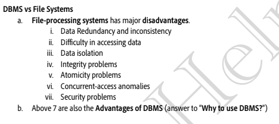
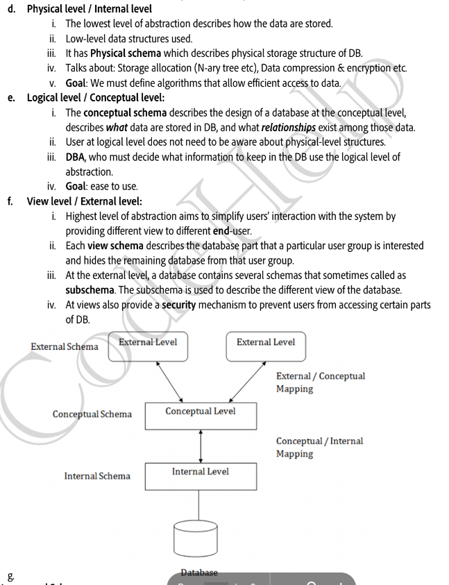
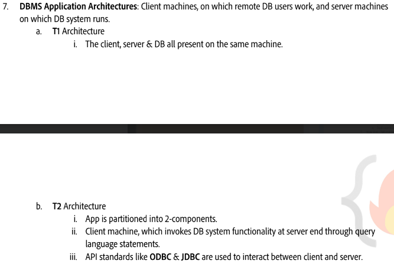
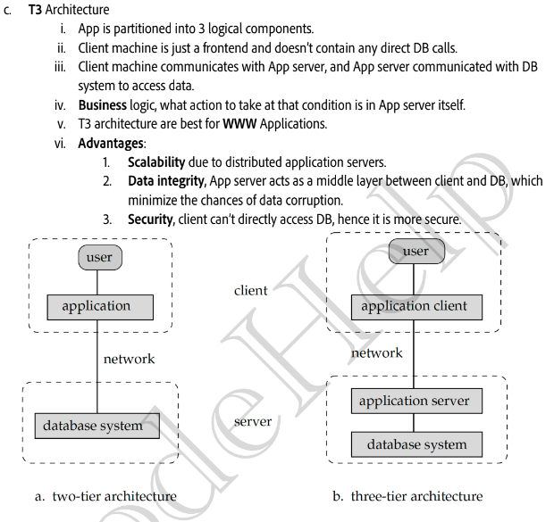
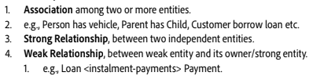
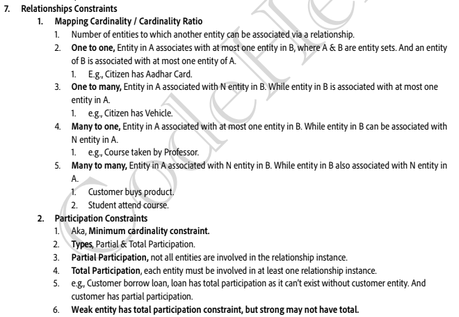
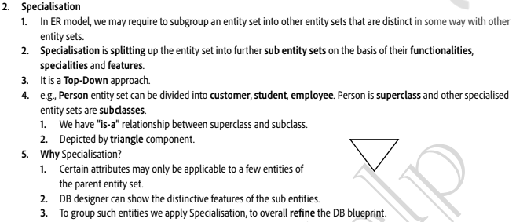
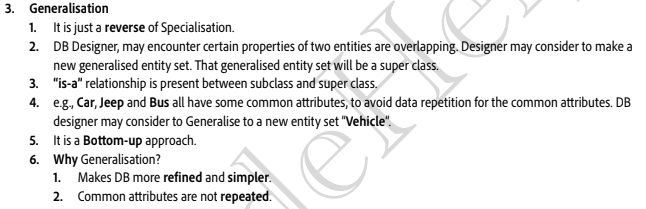
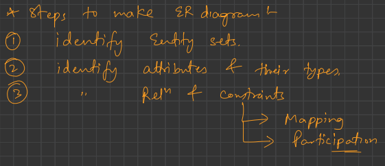

# View of Data (Three Schema Architecture)

# Tier 1 vs Tier 2 vs Tier 3

# Relationship

# Relationship Constraints

# Specialization

# Generalization

# How to think and formulate an ER Diagram || Banking System ER Model
