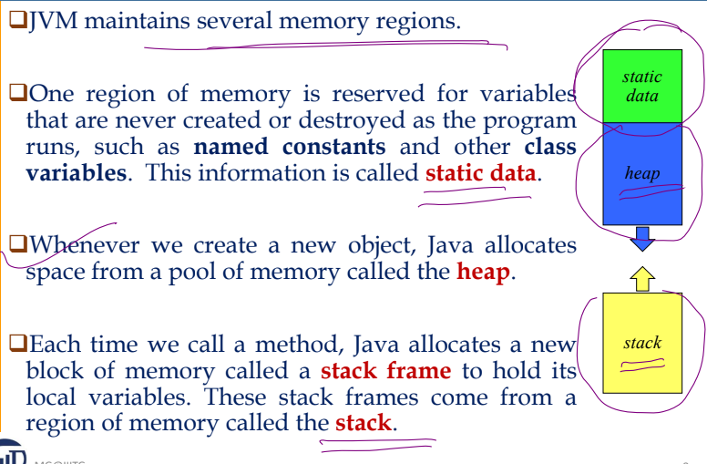
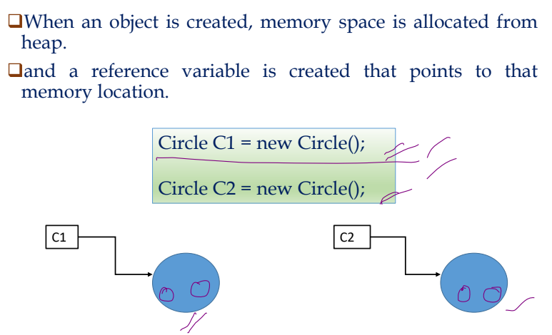
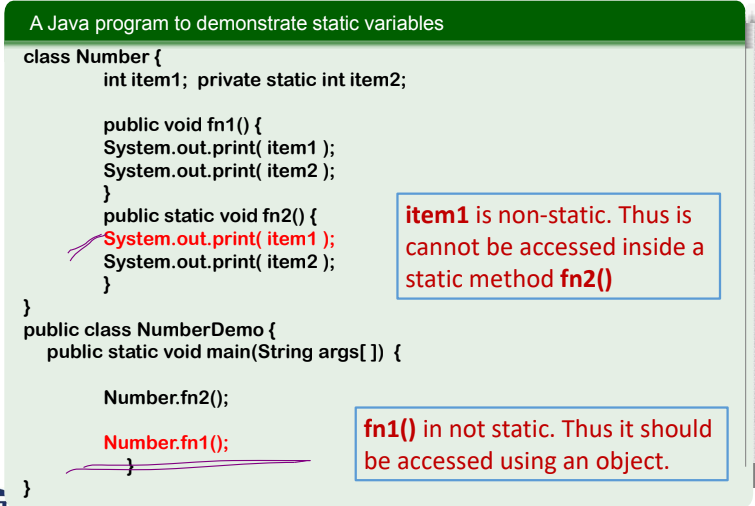
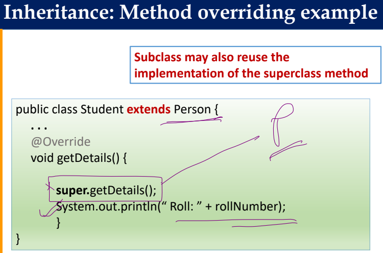
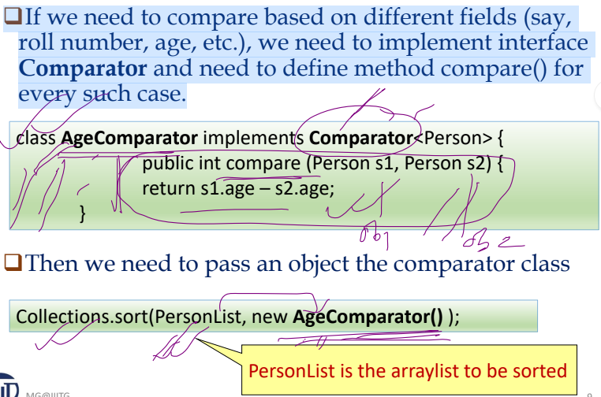

# Object
Any entity that has state and behavior is known as an object. An Object can be defined as an instance of a class ~ "Each object has its own set of characterstics and behaviors as defined by the class."

# Class
Collection of objects is called class. It is a logical entity. It is a blueprint for creating objects. Class is a user defined data type.

> What is the need for OOPs?<br>
The concept of “objects” allows the OOPs model to easily access, use and modify the instance data and methods, interact with other objects, and define methods in runtime (during the execution of the program)

### Package is a bundle of classes
- Scanner in Util package.
- ArrayList in util
- Java Lang is default package.

### Primitive types (e.g. int, float)  vs  Reference types (e.g. String, Account, Book)
- Each element in an array is initialized to 0 (for primitive types) or null (for reference types)

# Access Modifier:
Defines the access type of the method i.e. from where it can be accessed in your application.
- **public:** Accessible everywhere.
- **protected:** Accessible within the same package and by subclasses (including subclasses declared outside the package).
- **private:** Accessible only within the defining class.
- **default (no modifier):** Accessible within the same class and package.

> When you do not explicitly mention anything?
Access specifier: Default


# Constructor
- Constructor is a special type of method that is used to initialize the object.
- Java constructor is invoked at the time of object creation.

Sample code

```java
public class Student {
    int id;
    String name;

    Student(){}     //Default constructor
    Student(int i, String n) { //Parameterized constructor
        id = i;
        name = n;
    }
    void display() {
        System.out.println(id + " " + name);
    }
    public static void main(String args[]) {
        Student s1 = new Student();     // invoking constructor at object creation
        Student s2 = new Student(222, "Aryan");
        s1.display();
        s2.display();
    }
}
```

# Allocation of Memory


### Memory allocation for Objects and GC

JVM calls automatic memory management module called
Garbage collector (GC) when heap becomes almost full. Any unreachable object becomes a candidate for GC.


## Memory Leak in JAVA
Java performs automatic garbage collection to manage memory, destroying objects that are no longer needed. However, memory leaks can occur when an application creates many objects that remain referenced but are no longer used. These useless objects prevent the garbage collector from reclaiming memory, potentially causing the program to exceed its memory limit and throw an `OutOfMemoryError`. To prevent memory leaks, it's important to remove references to objects that are no longer required, making them eligible for garbage collection.



## Types of variables
- Instance Variables (Non-Static Fields): Each object will have their individual values

- Class Variables (Static Fields): Only one copy exists for a class; all the objects share it.

- Local Variables: Variables declared inside a method/function

## Static variables and static methods

- Static variables are typically used for a class-wide
information. E.g. To count total number of objects created for a class
- Public static members are accessed using class name. E.g. Math.random(); Math.PI;
- Static methods can access static variables and static methods directly. They can access non-static variables and methods only by creating an object of the class.

LOOK!!


> The “Arrays” class of util package supports a number of static methods. Eg: int [ ] intArray = { 7, 8, 1, 5, 9 }; Arrays.sort(intArray);

## Wrapper Class
Wrapper class converts (wraps) primitive type to its
equivalent Reference type(int-Integer, double-Double, etc.)
- Many supported data structures in Java (such as
Arraylist) works only with Reference type.

Eg: 
> ArrayList<Integer> integerList = new ArrayList<Integer>();<br>
> ArrayList<Student> st = new ArrayList<Student>(); <br>
> Integer myIntObj = new Integer(5); <=> Integer myIntObjNew = 7;

## CLI Running
```
$ javac CommandLineDemo.java  
//convert .java to .class [compiles it into bytecode that can be executed by (JVM).]

$ java CommandLineDemo 3 1 2 
```

## Method overriding
Subclass can redefine a method to do specific work. The signature of the method has to be same(name, return type, parameters)




## Association, Aggregation and Composition 
- Association: General relationship, no ownership (e.g., Teacher-Student).
- Aggregation: Weak ownership, independent lifecycle. "HAS-A" relationship (e.g., Library-Book).
- Composition: Strong ownership, dependent lifecycle (e.g., House-Room).

## Sorting objects using comparator



## Message Passing
Objects communicate with one another by sending and receiving information to each other.
