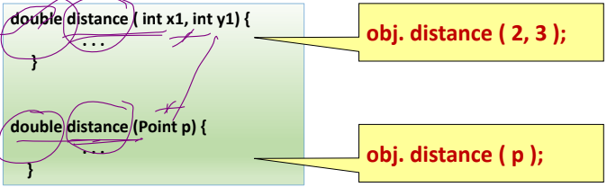

# OOPs

- Encapsulation
- Abstraction
- Inheritance
- Polymorphism

---

# Encapsulation
It is defined as the wrapping up of data under a single unit - like class. It is the mechanism that binds together the code and the data it manipulates. Example is of simple class we generally use. Using access modifiers.

- In order to achieve encapsulation in java follow certain steps as proposed below:

    - Declare the variables as private
    - Declare the setters and getters to set and get the variable values

---
# Abstraction
Abstraction is the process in which we only show essential details/functionality to the user. The non-essential implementation details are not displayed to the user.

- In Java, abstraction is achieved by interfaces and abstract classes
- Abstract class can’t be instantiated directly with the new operator

### Abstract Classes
An abstract class cannot be instantiated directly. It serves as a blueprint for other classes.

- It can have abstract methods (methods without a body) and concrete methods (methods with a body)

```java
abstract class Shape { 

	String color; 
	abstract double area(); 
	public abstract String toString(); 

	public Shape(String color) { 
		System.out.println("Shape constructor called"); 
		this.color = color; 
	} 

	public String getColor() {
        return color;
    } 
} 
```
```java

class Circle extends Shape { 
	double radius; 

	public Circle(String color, double radius) { 
        super(color); 
		System.out.println("Circle constructor called"); 
		this.radius = radius; 
	} 

	@Override
    double area() { 
		return Math.PI * Math.pow(radius, 2); 
	} 

	@Override
    public String toString() { 
		return "Circle color" + super.getColor() + "area" + area(); 
	} 
} 

public class Test { 
	public static void main(String[] args) { 
		Shape s1 = new Circle("Red", 2.2); 
		System.out.println(s1.toString()); 
	} 
}

```


### Interface
An interface is a completely abstract type that can only contain abstract methods (prior to Java 8) and constants.

- Cannot have constructors.
- No instance variables; only constants are declared as
data members ( Interface)

```java
interface Animal {
    void eat();
}

interface Pet {
    void play();
}
```

```java
class Dog implements Animal, Pet {
    String name;

    Dog(String name) {
        this.name = name;
    }

    @Override
    public void eat() {
        System.out.println(name + " is eating.");
    }

    @Override
    public void play() {
        System.out.println(name + " is playing.");
    }
}

public class Main {
    public static void main(String[] args) {
        Dog myDog = new Dog("Buddy");
        
        // Using methods from Animal interface
        myDog.eat();
        
        // Using methods from Pet interface
        myDog.play();
    }
}
```

### Difference b/t Abstract Class and Interface:
- Abstract Class: A class can inherit from only one abstract class (single inheritance). Can extend other classes and implement multiple interfaces.
- Interface: A class can implement multiple interfaces (multiple inheritance of type).
An interface can extend multiple other interfaces.

### Benefits of Abstraction
- Simplification - reduces complexity by hiding unnecessary details
- Security - By exposing only necessary details, abstraction can enhance security by preventing access to implementation details.
- Code Reusability

>Default methods enable interfaces to have behavior while maintaining backward compatibility.

---
# Inheritance
Inheritance is a mechanism in which one class acquires the property of another class. For example, a child inherits the traits of his/her parents.

- Inheritance represents the IS-A relationship. For example, a dog IS-A animal.
- Inheritance is a way to reuse code i.e. if there is a class with a lot of functionality and you want to create a new class with a little bit of modification
- Inheritance in Java is implemented using extends keyword.

>Terminologies 
- Base Class/Super Class
- Derived Class/Sub Class

```java
// Super class
class Base {
	int x;

	// Constructor of super class
	Base(int _x) { 
        x = _x; 
    }
}
// Sub class
class Derived extends Base {

	int y;
	Derived(int _x, int _y){
		super(_x);
		y = _y;
	}

	void Display(){
		System.out.println("x = " + x + ", y = " + y);
	}
}
// Main class
public class GFG {
	public static void main(String[] args){
		Derived d = new Derived(10, 20);
		d.Display();
	}
}

Output
x = 10, y = 20
```

NOTE: constructor of super class is automatically called using super... and it is compulsory. <br>
Superclass’s constructor should be called from the
subclass’s constructor using super()

## Types of Inheritance

- Single Inheritance: Class B --> Class A
- Multilevel Inheritance: Class C --> class B --> Class A.
- Hierarchy Inheritance: Class B --> Class A <-- Class C
- Multiple Inheritance: Class C --> Class A and B. 
(Here A and B both are superclass and C is only one child class. Java is not supporting Multiple Inheritance, but we can implement using Interfaces.)
- Hybrid Inheritance: Class D --> Class B and Class C. Class B and C --> Class A. 

1. Single Inheritance
```java
class Animal {
    void eat() {
        System.out.println("eating...");
    }
}
class Dog extends Animal {
    void bark() {
        System.out.println("barking...");
    }
}
public class TestInheritance {
    public static void main(String[] args) {
        Dog d = new Dog();
        d.bark();
        d.eat();
    }
}
```


2. Multilevel Inheritance
```java
class Animal {
    void eat() {
        System.out.println("eating...");
    }
}
class Dog extends Animal {
    void bark() {
        System.out.println("barking...");
    }
}
class BabyDog extends Dog {
    void weep() {
        System.out.println("weeping...");
    }
}
public class TestInheritance {
    public static void main(String[] args) {
        BabyDog d = new BabyDog();
        d.weep();
        d.bark();
        d.eat();
    }
}
```

3. Hierarchy Inheritance
```java
class Animal {
    void eat() {
        System.out.println("eating...");
    }
}
class Dog extends Animal {
    void bark() {
        System.out.println("barking...");
    }
}
class Cat extends Animal {
    void meow() {
        System.out.println("meowing...");
    }
}
public class TestInheritance {
    public static void main(String[] args) {
        Cat c = new Cat();
        c.meow();
        c.eat();
    }
}
```
4. Multiple Inheritance --> not allowed in java. Implemented through interface

```java
interface Printable {
    void print();
}
interface Showable {
    void show();
}
class TestInterface1 implements Printable, Showable {
    public void print() {
        System.out.println("Hello");
    }
    public void show() {
        System.out.println("Welcome");
    }
    public static void main(String[] args) {
        TestInterface1 obj = new TestInterface1();
        obj.print();
        obj.show();
    }
}
```
5. Hybrid Inheritance --> not allowed in java. Implemented through interface
    
```java
interface Printable {
    void print();
}
interface Showable {
    void show();
}
class A implements Printable {
    public void print() {
        System.out.println("Hello");
    }
}
class B implements Showable {
    public void show() {
        System.out.println("Welcome");
    }
}
class TestInterface2 implements Printable, Showable {
    public void print() {
        System.out.println("Hello");
    }
    public void show() {
        System.out.println("Welcome");
    }
    public static void main(String[] args) {
        TestInterface2 obj = new TestInterface2();
        obj.print();
        obj.show();
    }
}
```
## Diamond Problem
Multiple inheritance is when a child class is inherits the properties from more than one parents and the methods for the parents are same (Method name and parameters are exactly the same) then child gets confused about which method will be called. This problem in Java is called the Diamond problem.

>Example of Java Diamond Problem
```java
// Parent Class1 
class Parent1 { 
	void fun() { System.out.println("Parent1"); } 
} 

// Parent Class2 
class Parent2 { 
	void fun() { System.out.println("Parent2"); } 
} 

class test extends Parent1, Parent2 { 
	// main function 
	public static void main(String[] args) 
	{ 
		test t = new test(); 
		t.fun(); 
	} 
}
```

> Solution of Diamond Problem in Java

We implement multiple inheritance by interface.Interface are created by using interface keyword. It contains all methods by default as abstract we don’t need to declared as abstract ,compiler will do it implicitly. We can’t instantiate interface for this we have to use a class which will implement the interface and will write the definitions of its all functions.

```java
interface Parent1 { 
	default void fun(); 
} 
interface Parent2 { 
	default void fun(); 
} 

// Inheritance using Interfaces 
class test implements Parent1, Parent2 { 
	public void fun(){ 
        Parent1.super.fun();
		System.out.println("fun function"); 
	} 
} 
// Driver Class 
class test1 {
	public static void main(String[] args) { 
		test t = new test(); 
		t.fun(); 
	} 
}
```

---
# Polymorphism
Polymorphism is the ability to define more than one function with the same name in a class. Different definitions with same method name.

- Polymorphism was achieved among different classes
(Person, Student, Faculty) using method overriding

- Polymorphism may also be achieved within the same
class using method overloading - methods with same name but different signature



#### Dynamic Binding
getDetails() method in Person, Student, Faculty
- Depending on the calling object, different tasks are
performed.
- Type of the object is determined at runtime and
appropriate body of the method is invoked --> dynamic
binding (Associating a method call with its body is called binding) 
- Eg: Person p;
p = new Student();
p.getDetails();     // Student’s getDetails() is called
<br>
p=new Faculty();
p.getDetails();     // Faculty’s getDetails() is called


### Types of Polymorphism

1. **Compile-Time Polymorphism (Static):**
   - The decision of which method to call is made at compile time.
   - **Method Overloading:** Multiple methods with the same name but different parameters.
     ```java
     class MathOperations {
         int add(int a, int b) {
             return a + b;
         }

         double add(double a, double b) {
             return a + b;
         }
     }

     public class Main {
         public static void main(String[] args) {
             MathOperations mo = new MathOperations();
             System.out.println(mo.add(5, 3)); // Calls int add(int a, int b)
             System.out.println(mo.add(5.5, 3.2)); // Calls double add(double a, double b)
         }
     }
     ```

2. **Run-Time Polymorphism (Dynamic):**
   - Achieved through **method overriding**.
   - The decision of which method to call is made at runtime.
   - **Method Overriding:** A subclass provides a specific implementation of a method that is already defined in its superclass.
     ```java
     class Animal {
         void makeSound() {
             System.out.println("Animal makes a sound");
         }
     }

     class Dog extends Animal {
         @Override
         void makeSound() {
             System.out.println("Dog barks");
         }
     }

     class Cat extends Animal {
         @Override
         void makeSound() {
             System.out.println("Cat meows");
         }
     }

     public class Main {
        public static void main(String[] args) {
            Animal myDog = new Dog();
            Animal myCat = new Cat();

            myDog.makeSound();    // Output: Dog barks
            myCat.makeSound();    // Output: Cat meows
        }
     }
     ```

### Key Points

- **Method Overloading:**
  - Same method name, different parameters.
  - Compile-time polymorphism.
  - Example: `void print(int i)`, `void print(double d)`.

- **Method Overriding:**
  - Same method name and parameters, different implementation in subclass.
  - Runtime polymorphism.
  - Example: Superclass method `void draw()`, subclass method `void draw()`.


